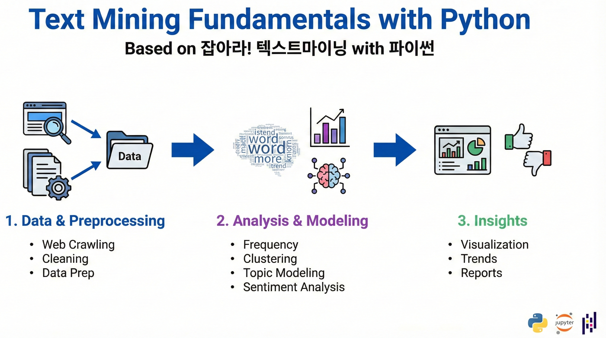

  

# Text Mining Fundamentals with Python

## About

This repository provides a foundational "ABC" guide to text mining, based on the textbook **"잡아라! 텍스트마이닝 with 파이썬"**. It covers the complete workflow from data acquisition to advanced modeling like Topic Modeling and Deep Learning.

## Project Structure

The repository is organized into specific task-based Jupyter Notebooks with datasets stored in the `data/` folder.

| File Name | Purpose |
| :--- | :--- |
| **data/** | Contains CSV and TXT datasets (e.g., `comments.csv`, `NRC.txt`). |
| `Word Frequency Analysis.ipynb` | Basic text statistics and word count analysis. |
| `Simple sentiment analysis.ipynb` | Introductory lexicon-based sentiment classification. |
| `Sentiment Analysis.ipynb` | Advanced sentiment analysis using dictionary methods. |
| `Partitional Clustering.ipynb` | K-Means and other non-hierarchical grouping techniques. |
| `LSTM-based Sentiment Analysis.ipynb` | Deep learning approach for sentiment using TensorFlow. |
| `LDA Topic Modeling.ipynb` | Extracting hidden topics with Latent Dirichlet Allocation. |
| `Hierarchical Clustering.ipynb` | Nested grouping of documents based on similarity. |
| `Crawling.ipynb` | Web data collection and automated scraping basics. |
| `Co-occurrence Frequency Analysis.ipynb` | Analyzing terms that appear together in context. |
| `Association Analysis with Word2Vec.ipynb` | Word embedding-based relationship discovery. |
| `Association Analysis with TF-IDF & Cosine Similarity.ipynb` | Traditional vector-based text similarity analysis. |

## Setup Instructions

To ensure a consistent environment, follow these steps :

### Conda Method (Recommended)

1. **Create Environment**: `conda create -n textmining python=3.9 -y` 

2. **Activate**: `conda activate textmining` 

3. **Install Requirements**: `pip install ipykernel notebook` and `pip install -r requirements.txt` 

4. **Register Kernel**: `python -m ipykernel install --user --name textmining --display-name "Python (textmining)"` 

### Manual Pip Method

If not using Conda, install the following core libraries directly:
**pandas, nltk, afinn, numpy, matplotlib, scikit-learn, scipy, gensim, wordcloud, pyclustering, networkx, tensorflow, beautifulsoup4, requests**

## Usage

1. Open your terminal in the project directory.

2. Launch the environment: `jupyter notebook`.

3. Open any `.ipynb` file.
4. Set the kernel to **Python (textmining)** via the 'Kernel' menu.

## Credits

* **Textbook**: "잡아라! 텍스트마이닝 with 파이썬"
* 
**Source Material**: Environment setup and curriculum designed by me Alex (**dadaboev170998@gmail.com**).
 
